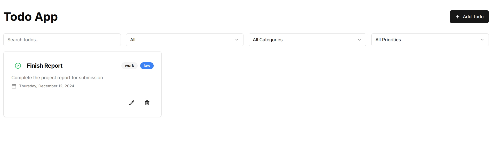

# Todo App

Welcome to the Todo App! This project includes both a **frontend** and a **backend** for managing tasks. The app is built using **Next.js** for the frontend and **MERN stack** (MongoDB, Express, Node.js) for the backend.

---

## Table of Contents

- [About the Project](#about-the-project)
- [Getting Started](#getting-started)
- [Getting Started](#docker-compose-setup)
- [Running with Docker](#running-with-docker)
- [Accessing the App](#accessing-the-app)


---

## About the Project

This Todo App helps users manage tasks by allowing them to create, edit, delete, and view their todos. The backend is built with Node.js, Express, and MongoDB, while the frontend uses Next.js.



### Project structure
```plaintext
.
├── todo_frontend/
│   ├── ...
│   ├── Dockerfile
├── todo_backend/
│   ├── ...
│   ├── Dockerfile
├── docker-compose.yml
├── README.md
```

### Key Folders
- **`todo_frontend/`**: Contains the Next.js frontend code.
- **`todo_frontend/Dockerfile`**: Define dockerfile for backend.
- **`todo_backend/`** Contains the MERN stack backend code.
- **`todo_backend/Dockerfile`**: Define dockerfile for backend.
- **`docker-compose.yml`**: Defines the services for the frontend and backend.


---

## Getting Started

To get started locally, clone this repository and follow the instructions below.

### Prerequisites

Make sure you have the following installed:
- [Docker](https://www.docker.com/get-started) and [Docker Compose](https://docs.docker.com/compose/install/)

---
## Docker Compose Setup

I used **multi-stage Docker builds** and **slim images** to reduce the overall image size. However, the images are still relatively large due to the MongoDB in-memory server used, which requires the full Node.js runtime.


## Running with Docker

This project includes a `docker-compose.yml` file to easily set up both the frontend and backend services.

1. Clone the repository:
   ```bash
   git clone https://github.com/godcandidate/todo-app.git
   cd todo-app

2. Build and start the services with Docker Compose:
   ```bash
   docker compose up

## Accessing the App

- Frontend: The frontend will be available at http://localhost:3000.

- Backend: The backend API will be available at http://localhost:4000.

